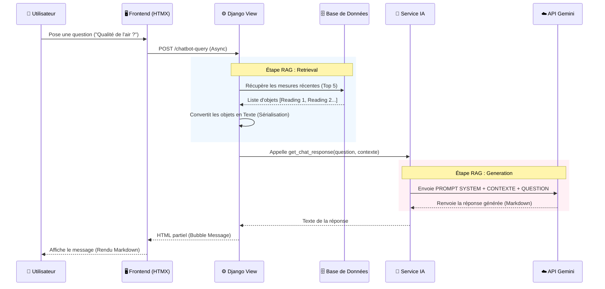

# 📘 Guide de Référence : Intégration IA Générative (RAG)

Ce document sert de **référence technique** pour intégrer un modèle d'IA (comme Google Gemini ou OpenAI) dans une application web existante ou future (ex: PharmaGN). Il détaille l'architecture RAG mise en place dans EcoWatch.

---

## 1. 🎯 Objectif & Concept

L'objectif est de permettre à l'IA de répondre à des questions sur des données **privées et temps réel** (capteurs, stocks, patients...), ce qu'elle ne peut pas faire nativement.

### Architecture RAG Simplifiée (Retrieval-Augmented Generation)

1.  **Retrieval (Récupération)** : Le système va chercher les données fraîches en Base de Données.
2.  **Augmented (Enrichissement)** : Le système injecte ces données dans le "cerveau" de l'IA via le prompt.
3.  **Generation (Réponse)** : L'IA formule une réponse naturelle basée *uniquement* sur ces données injectées.

| Avantage | Pourquoi c'est crucial ? |
| :--- | :--- |
| **Zéro Hallucination** | L'IA ne peut pas inventer de chiffres, elle lit ce qu'on lui donne. |
| **Temps Réel** | Pas besoin de réentraîner le modèle à chaque nouvelle donnée. |
| **Sécurité** | Les données ne servent qu'au contexte de la conversation, elles ne partent pas entraîner le modèle public (selon les CGU Pro). |

---

## 2. 🔄 Le Flux de Données (Data Flow)

Voici le parcours exact d'une question, du clic utilisateur jusqu'à l'affichage de la réponse.



---

## 3. 🛠️ Implémentation Technique (Code & Rôles)

### 3.1. Le Cerveau (Service IA)
**Fichier :** [`monitoring/services/gemini/service.py`](file:///d:/Projet_Python/groupe4/monitoring/services/gemini/service.py)
C'est ici qu'on "programme" le comportement de l'IA via le **System Prompt**.

```python
# Le prompt système définit la personnalité et les règles
system_prompt = f"""
Tu es l'assistant EcoWatch.
Voici les données actuelles (CONTEXTE RÉEL) :
{context_data}

Consigne : Réponds à la question de l'utilisateur en utilisant UNIQUEMENT le contexte ci-dessus.
"""
```

### 3.2. Le Chef d'Orchestre (Vue Django)
**Fichier :** [`monitoring/views_htmx.py`](file:///d:/Projet_Python/groupe4/monitoring/views_htmx.py)
C'est lui qui fait le lien entre vos données et l'IA.

```python
def chatbot_query(request):
    # 1. RÉCUPÉRATION (Retrieval)
    # On prend les 5 derniers relevés pour ne pas saturer le contexte
    readings = Reading.objects.order_by('-timestamp')[:5]
    
    # 2. SÉRIALISATION
    # On transforme les objets DB en texte lisible par l'IA
    context_str = "\n".join([f"{r.timestamp}: {r.value}" for r in readings])
    
    # 3. GÉNÉRATION
    response = ai_service.get_response(user_msg, context=context_str)
    
    return render(request, 'partials/message.html', {'response': response})
```

### 3.3. L'Interface (Frontend)
**Fichier :** [`monitoring/templates/monitoring/partials/chatbot.html`](file:///d:/Projet_Python/groupe4/monitoring/templates/monitoring/partials/chatbot.html)
- Utilise **HTMX** pour l'envoi sans rechargement (`hx-post`).
- Utilise **Marked.js** pour transformer le Markdown de l'IA (gras, listes) en HTML propre.

---

## 4. ✅ Bonnes Pratiques pour Futurs Projets (ex: PharmaGN)

1.  **Toujours Contextualiser (RAG)**
    - Ne demandez jamais "Quel est le stock ?" à l'IA brute.
    - Donnez-lui : "Le stock est : Doliprane (50), Advil (10). Quel est le stock ?"

2.  **Séparer les Services**
    - Gardez une couche d'abstraction (`AIService`). Si demain Google augmente ses prix, vous pourrez passer à OpenAI ou Claude en changeant une seule ligne dans [`monitoring/services/gemini/config.py`](file:///d:/Projet_Python/groupe4/monitoring/services/gemini/config.py).

3.  **Gérer les Erreurs**
    - Les API d'IA peuvent échouer (timeout, quota). Prévoyez toujours un `try/except` qui renvoie "Service indisponible" plutôt que de faire planter la page.

4.  **Sécurité des Clés (Critique)**
    - Jamais de clé API dans le code (`.py`).
    - Toujours dans un fichier `.env` non-versionné.
    - Utilisez `.gitignore` pour exclure `.env`.

5.  **Optimiser les Coûts**
    - N'envoyez pas *toute* la base de données dans le contexte. Filtrez les données pertinentes (ex: "Les 5 dernières commandes" ou "Les produits dont le stock < 10").

---

## 5. Dépannage Rapide

- **Réponse "Je ne sais pas"** : Vérifiez que `context_data` n'est pas vide dans la vue.
- **Erreur 429 (Quota)** : Vous avez dépassé la limite gratuite. Attendez quelques minutes.
- **KeyError/Auth** : Vérifiez que `GOOGLE_GENAI_API_KEY` est bien chargée dans `os.environ`.